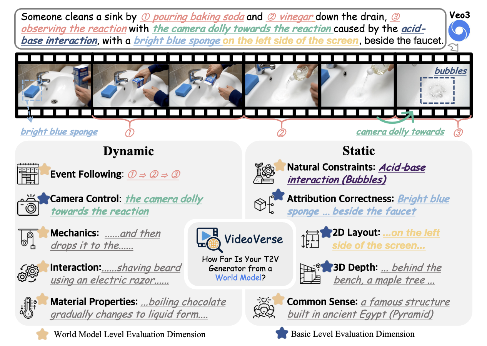

#  VideoVerse: How Far is Your T2V Generator from a World Model?

Official repository for the paper ["VideoVerse: How Far is Your T2V Generator from a World Model?"](https://arxiv.org/abs/2510.08398).

[🌐 Webpage](https://www.naptmn.cn/Homepage_of_VideoVerse/) [📖 Paper](https://arxiv.org/abs/2510.08398) [🤗 Huggingface Dataset](https://huggingface.co/datasets/NNaptmn/VideoVerse) [🏆 Leaderboard](https://www.naptmn.cn/Homepage_of_VideoVerse/#leaderboard)

## 🔥 News
- **[2025.10.17]** 🔥 Sora2 achieves a new SOTA! Cool! The videos from Sora2 have been released.
- **[2025.10.17]** 🔥 VideoVerse Dataset are now release!
- **[2025.10.05]** 🔥 Evaluation code, prompt files, and evaluation questions are now released!

## Introduction

VideoVerse is a benchmark for evaluating current T2V (Text-to-Video) models from the perspective of world models. It covers both static and dynamic dimensions, with each dimension containing several world-model-level and basic-level evaluation aspects essential for T2V models.



## 🔧 How to Start

VideoVerse is organized for easy benchmarking of T2V models:

### 📑 Prompt Files

Our prompt file is located at `prompt/prompts_of_VideoVerse.json`, which contains all prompts and their corresponding evaluation information.

### Generate Videos & Directory Organization

For each dictionary in the prompt file, generate a video using the `"t2v_prompt"` field under `"t2v_following_prompt"`, and name the video using the corresponding key. The resulting video files should be organized as follows:

```
VIDEO_FOLDER/
  8f348e44-546c-4319-aefa-b860c02d9cbc.mp4
  dc4fa681-8b4a-413d-9571-29af7aa36c2e.mp4
  DICT_KEY.mp4
```

### 🧪 Evaluation with Gemini 2.5 Pro

As recommended in our paper, we suggest using Gemini 2.5 Pro for video evaluation. Here is how to integrate your Gemini 2.5 Pro API with our evaluation code:

1. **Set variables:**  
   According to the official Gemini 2.5 Pro API, you need to upload your video to a platform that provides a public URL, such as:  
   `https://www.naptmn.cn/Homepage_of_VideoVerse/static/videos/banner_video.mp4`  
   We recommend using GitHub as a free video hosting platform.

2. **Run evaluation:**  
   After obtaining the public URL for your video, replace the `{BASEURL}` variable in `scripts/eval_with_Gemini_like_video_url.py`.  
   Then, update the `request_api_video` function in the same script to use your own Gemini 2.5 Pro API endpoint.  
   Run the evaluation script:
   ```bash
   python scripts/eval_with_Gemini_like_video_url.py
   ```
   The results will be saved as `eval_res.json` in the `eval_res` directory.

3. **Summarize results:**  
   After obtaining `eval_res.json`, update the `eval_res_path` in `scripts/cal_acc.py` to point to your result file.  
   Run the script, and a new file ending with `_report.json` will be generated in the same directory, containing the evaluation summary.

### 📊 Evaluation with Open-Source VLMs (e.g., QwenVL)

When using open-source VLMs, you do not need to upload videos to a public URL. Simply place them in the `eval_videos` directory.

1. **Replace the model checkpoints:**  
   Update the checkpoints path in `scripts/eval_with_other_vlm.py`.

2. **Run with other VLMs:**  
   ```bash
   python scripts/eval_with_other_vlm.py
   ```

## 📌 Citation

If you find the code useful for your work, please star this repo and consider citing:

```bibtex
@article{wang2025videoverse,
  title={VideoVerse: How Far is Your T2V Generator from a World Model?},
  author={Wang, Zeqing and Wei, Xinyu and Li, Bairui and Guo, Zhen and Zhang, Jinrui and Wei, Hongyang and Wang, Keze and Zhang, Lei},
  journal={arXiv preprint arXiv:2510.08398},
  year={2025}
}
```

## 🙋‍♂️ Questions?

Open an [issue](https://github.com/Zeqing-Wang/VideoVerse/issues).

**Enjoy using VideoVerse!** 🚀🖼️🤖
